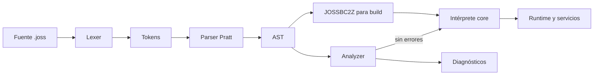

# Arquitectura del lenguaje Joss

[Índice](README.md) · Antes: [estado](ESTADO_IMPLEMENTACION.md) · Después: [contribuir](CONTRIBUIR.md)

## Pipeline real

```text
fuentes .joss
  → lexer (`pkg/parser/lexer.go`)
  → parser Pratt (`pkg/parser`)
  → AST (`pkg/parser/ast*.go`)
  → análisis semántico (`pkg/analyzer`)
  → diagnósticos (`pkg/diagnostics`)
  → intérprete AST (`pkg/core/evaluator*.go`, `executor.go`)
  → runtime integrado (`pkg/core`, `pkg/server`)
```



`joss analyze` conserva cada archivo como una `analyzer.SourceUnit`; no concatena ASTs perdiendo el origen. Primero registra declaraciones globales de funciones y clases, después analiza cada método con un scope léxico independiente. Las clases nativas provienen de `Runtime.RegisterNativeClasses`; los plugins aportan sus índices de símbolos JP v2.

## Responsabilidades

| Paquete | Responsabilidad |
|---|---|
| `pkg/parser` | Tokens, lexer, precedencias, parser y nodos AST. |
| `pkg/typesystem` | Nombres canónicos, inferencia, coerción explícita y compatibilidad de asignación. |
| `pkg/analyzer` | Unidades fuente, scopes, símbolos, inferencia de expresiones, firmas y flujo alcanzable. No depende del runtime. |
| `pkg/diagnostics` | Modelo común: código, severidad, mensaje, archivo, rango, explicación y sugerencia. |
| `pkg/core` | Adaptación de catálogos reales al analizador, intérprete y primitivas integradas. |
| `pkg/runtime/errors` | Error runtime estructurado y frames de stack Joss, sin dependencias de framework. |
| `pkg/runtime/value` | Semántica de valores independiente del evaluator, incluida indexación Unicode. |
| `pkg/runtime/plan`, `pkg/runtime/frame` | Planes de callables, slots y representación etiquetada usados para acelerar resolución local; no forman bytecode portable. |
| `pkg/pluginruntime`, `pkg/pluginpkg` | Carga aislada, verificación y resolución de símbolos de plugins JP v2. |
| `pkg/bytecode` | Serialización comprimida del AST. No es código máquina ni LLVM IR. |
| `pkg/vm` | Compilador/VM experimental independientes. El CLI y `pkg/core` no los usan como ruta predeterminada. |
| `cmd/joss` | CLI, análisis de proyecto, ejecución, build y administración. |
| `vscode-joss` | LSP/editor. Consume el catálogo generado del núcleo. |

## Fuentes de verdad

- Keywords y símbolos: `pkg/parser/token.go`; `parser.KeywordNames()` y `parser.SymbolDefinitions()` son las proyecciones para lexer, formatter y generadores.
- Tipos y compatibilidad: `pkg/typesystem`, incluidas clasificaciones semánticas como `Type.IsNumeric()`.
- Métodos de primitivas: nombre y retorno en `pkg/typesystem/primitive_methods.go`. `pkg/analyzer` proyecta esa metadata y `pkg/core/primitives.go` conserva únicamente la implementación runtime. Toda definición debe quedar cubierta por `TestPrimitiveMethodCatalogHasRuntimeImplementations`.
- Built-ins globales: `pkg/core/builtins.go` declara una sola vez nombre, dominio de dispatcher y retorno. El runtime despacha directamente por ese descriptor y rechaza nombres fuera del catálogo.
- Clases/métodos nativos: llamadas a `registerNative` dentro de `Runtime.RegisterNativeClasses()`; sus retornos se tipan en `pkg/core/native_signatures.go`.
- Símbolos de plugins: `pluginpkg.SymbolIndex` incluido en cada `.jp`.
- Diagnósticos: `pkg/diagnostics.Diagnostic` y códigos emitidos por `pkg/analyzer`.
- Catálogo de VS Code: `vscode-joss/src/server/generated/languageCatalog.json`, generado mediante `go run ./tools/cataloggen`.

CI ejecuta `go run ./tools/cataloggen --check`; editar a mano el catálogo generado no es válido.

## Scopes y símbolos

- Cada función, método, `Init` y closure tiene un scope propio.
- Los parámetros pertenecen únicamente a su callable.
- Los bloques de control usan el scope del callable para reflejar el runtime actual.
- El binding de `foreach` puede reutilizarse en otro loop; el runtime lo trata como asignación.
- Las clases y funciones top-level se resuelven a nivel de proyecto.
- Los globals nativos y símbolos de plugins se inyectan mediante `analyzer.Environment`.
- Una función con nombre no hereda variables fuente del caller ni variables top-level: recibe parámetros, locales, `this` y bindings del host/plugin. Una closure sí captura léxicamente.
- Los parámetros requieren tipo explícito; `mixed` nunca se introduce silenciosamente.
- Un parámetro `ref` recibe un alias temporal al binding mutable del caller. Analyzer y runtime exigen marca bilateral, l-value, no-constancia y tipo exactamente invariante.
- La visibilidad no tiene default: parser, analyzer y runtime conservan y validan `public`, `private` y `protected`.

## Build y ejecución

El modo de desarrollo interpreta el AST. Cada invocación de callable crea un frame léxico independiente; no existe scope dinámico entre caller y callee. Esto evita que una llamada recursiva lea o sobrescriba locales del caller. El runtime limita la profundidad a 1024 frames por defecto y las closures escriben únicamente sobre su entorno capturado. Los tipos de retorno anotados se validan en analyzer/runtime y el analyzer exige terminación exhaustiva demostrable.

Antes de ejecutar un callable, `pkg/runtime/plan` puede asignar slots a parámetros
y locales. `frame_runtime.go` usa esos slots y conserva un fallback para bindings
que no caben en el plan. Metadatos de clase, accesos y scopes se cachean; cualquier
cambio semántico debe comparar la ruta rápida con la ruta general. Los controles
de loops buscan saltos directos en el AST planificado y hoy no atraviesan todos
los ternarios/match, un límite registrado en la auditoría.

Las referencias seguras no exponen punteros de Go: `core.VariableReference` conserva el binding de valor/tipo/constancia durante una llamada y el evaluator desreferencia automáticamente. Una referencia no es un valor Joss almacenable ni cruza fronteras async/plugin.

`pkg/bytecode` codifica el AST con `gob` y compresión bajo la única cabecera aceptada `JOSSBC2Z`. Los builds nativos empaquetan ese bytecode junto con el runner Go; actualmente no existe un backend LLVM/Cranelift ni traducción AOT del programa Joss a código máquina. El compilador de plugins sí posee un IR JPBC separado; no debe confundirse con el pipeline del lenguaje principal.

El árbol `pkg/vm` contiene opcodes y una VM experimental. Su aritmética y sus
errores no definen la semántica publicada mientras no esté conectado al pipeline
anterior. Del mismo modo, JPBC sólo define ejecución de plugins. Al documentar
“compilación” indique cuál de las tres representaciones se está usando.

## Regla de dependencia

Las capas de lenguaje (`parser`, `typesystem`, `diagnostics`, `analyzer`) no importan `core`. `core` adapta sus registros al analizador. Esta dirección evita que el type checker dependa de efectos secundarios del servidor o de la base de datos.

El servidor mantiene sus adaptadores HTTP fuera del intérprete: `request_data.go` traduce `net/http` al mapa estable consumido por Joss y `rate_limiter.go` encapsula el estado de limitación. `handler.go` continúa como orquestador y no debe volver a absorber estas responsabilidades.

## Fronteras internas del evaluator

Las llamadas conservan una sola ruta evaluada. `call_arguments.go` transforma expresiones fuente y aplica binding posicional/nombrado/default/ref; `call_method.go` instala parámetros, administra el frame, recursión, defers y contrato de retorno; `callable_dispatch.go` adapta closures, métodos ligados, plugins y funciones Go a esa ruta; `evaluator_call.go` sólo resuelve una llamada fuente y el dominio del built-in. Los entry points públicos históricos delegan, no reimplementan reglas.

Los infijos se coordinan en `evaluator_infix.go` porque el orden observable —coalescencia, pipeline, short-circuit, entrada, evaluación derecha y salida— debe permanecer explícito. Sus conductas viven por dominio en `evaluator_control.go`, `evaluator_pipeline.go`, `evaluator_numeric.go`, `evaluator_stream.go` y `evaluator_update.go`. No se debe volver a añadir un operador directamente al coordinador salvo que afecte el orden de evaluación.

En el analyzer, `infer_nominal.go` amplía `typesystem.Assignable` con clases/interfaces del proyecto; `infer_narrowing.go` crea scopes refinados por `is` y comparaciones con null. Estas reglas permanecen separadas del runtime: comparten tipos y metadata, no ejecución ni estado.

## Tercera fase de arquitectura — septiembre de 2026

El analyzer tiene un pipeline semántico explícito: recolección de declaraciones, scope de proyecto, contratos nominales, cuerpos/callables y diagnósticos. Las responsabilidades se separan en archivos del mismo package para conservar encapsulación y evitar APIs públicas artificiales. `call_resolution.go` y `member_resolution.go` proyectan funciones, métodos, nativos, primitivos y plugins a la firma semántica de `Callable`; la ejecución continúa en `core`.

Antes de cambiar infraestructura se añadieron caracterizaciones de runtime (fork/reset/reuse), HTTP (503, CORS, sesiones, CSRF y respuesta) y publicación (ZIP, traversal, lockfile y registry). Estas pruebas ya encontraron y corrigieron un caso real de estado residual en `Runtime.Free`. El handler y el CLI siguen siendo coordinadores grandes: la extracción queda condicionada a completar WebSocket, response mapping y más casos registry.

Las reglas negativas se mantienen: analyzer no importa core, parser no conoce runtime, server no redefine semántica, formatter no descarta trivia para reutilizar lexer y VM no define semántica publicada. `@json` y `NativeMethodDefinition` siguen como deudas P1 hasta disponer de una representación común mantenible.

## Cuarta fase de arquitectura — septiembre de 2026

El lifecycle de runtime vive en `runtime_lifecycle.go`: construcción, pool, adquisición, bindings host y reset. `Runtime.Free` elimina todo estado per-request/per-execution y caches; no cierra `DB`, porque el pool SQL es un recurso externo compartido cuyo owner es la aplicación. `Fork` copia mapas mutables, reinicia cursores/caches y comparte únicamente AST/planes/configuración inmutable, plugin registry y recursos externos. Tests concurrentes y de aislamiento protegen estas reglas.

`MainHandler` adquiere el fork y registra inmediatamente un cleanup único. La adaptación de resultados reside en `response_writer.go`; request decoding continúa en `request_data.go`, rate limiting en `rate_limiter.go`, y session/CSRF permanece en el handler hasta completar sus backends. La frontera publicada reconoce string, JSON, RAW, FILE, STREAM y REDIRECT; otros valores continúan al fallback de archivo/404.

`NativeMethodDefinition` es metadata semántica, no reflection runtime. Publica sólo nombre, retorno y parámetros confiables, distinguiendo aridad desconocida. Stack, Queue y Math son la migración inicial; las demás clases usan el adaptador legacy. Todas se proyectan finalmente a `analyzer.Callable` y catálogos generados.

`pkg/viewtemplate` posee la sintaxis mínima compartida de directivas. El scanner reconoce rangos, quotes y paréntesis anidados; runtime y linter comparten la interpretación de `@json`. Rendering, acceso a archivos y políticas de lint permanecen en sus dominios.

La autoridad se divide explícitamente: syntax truth en parser, type truth en typesystem/analyzer, runtime truth en Interpreter/core y tooling como proyección. La VM sólo participa en un corpus diferencial declarado para features soportadas; nunca define semántica publicada.

## Quinta fase de arquitectura — septiembre de 2026

La quinta fase consolida ownership, concurrencia segura, contratos de sesión y ciclo de vida de plugins y WebSockets:

- **Ownership de Plugins y Drivers Nativos**: El registro global de plugins actúa como catálogo de librerías y ASTs inmutables; cada `Runtime` implementa `PluginAwareHost` y gestiona sus propios engines de ejecución AST (`pluginASTEngines`) y namespaces (`PluginNamespace`). Al realizar un `Fork()`, las instancias de engine se duplican ligadas al runtime forkeado, garantizando que plugins con funciones idénticas en paquetes distintos no colisionen y que el estado léxico nunca cruce requests. Los drivers dinámicos (`NativeDriverDefinition`) implementan `Unload()` seguro y atómico mediante primitivas de SO (`FreeLibrary`/`dlclose`), previniendo fugas de memoria o llamadas concurrentes sobre librerías descargadas.
- **Contratos de Sesión y Flash en Respuestas**: La persistencia de datos de sesión y flash para redirecciones HTTP se unifica bajo el contrato de almacenamiento (`saveSession`). Todo fallo en la persistencia de sesión durante una redirección cancela la emisión del header `Location` y genera un error HTTP 500 determinista, impidiendo que el cliente siga una redirección con estado inconsistente.
- **Aislamiento y Callbacks WebSocket**: La conexión WebSocket ejecuta callbacks reales en Joss (`onConnect`, `onMessage`, etc.) en un runtime forkeado independiente, inyectando correctamente parámetros de ruta (`$params`). Múltiples conexiones simultáneas no comparten frames ni colisionan en la recepción/emisión de tramas.
- **Defensa del Pool de Runtimes**: Para evitar que la devolución múltiple de un runtime a `sync.Pool` provoque carreras concurrentes en los mapas de clases o scopes, `Runtime.Free()` utiliza una guarda `freed` sincronizada con `poolMu`.
- **Expansión de Metadata Nativa**: Se amplía el catálogo canónico migrando 10 clases nativas a `NativeMethodDefinition` (`Stack`, `Queue`, `Math`, `JSON`, `Markdown`, `Str`, `UUID`, `Lang`, `Console`, `Zip`), permitiendo que el analyzer y LSP verifiquen parámetros y tipos de retorno sin invocar código nativo Go.
- **Posicionamiento Rune-Aware en View Templates**: El scanner y linter de directivas (`pkg/viewtemplate`) computa columnas exactas contando runas UTF-8, garantizando consistencia absoluta en diagnostics frente a caracteres multibyte.
