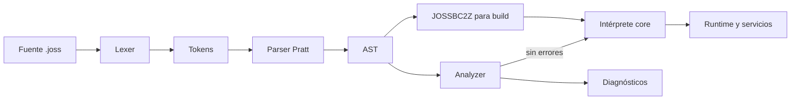

# Joss language architecture

[Index](README.md) ·

Before: [status](ESTADO_IMPLEMENTACION.md) ·

After: [contribute](CONTRIBUIR.md)

## Real pipeline

```text
fuentes .joss
  → lexer (`pkg/parser/lexer.go`)
  → parser Pratt (`pkg/parser`)
  → AST (`pkg/parser/ast*.go`)
  → análisis semántico (`pkg/analyzer`)
  → diagnósticos (`pkg/diagnostics`)
  → intérprete AST (`pkg/core/evaluator*.go`, `executor.go`)
  → runtime integrado (`pkg/core`, `pkg/server`)
```



`joss analyze` preserves each file as a `analyzer.SourceUnit` ;does not concatenate ASTs losing the origin.It first records global declarations of functions and classes, then parses each method with an independent lexical scope.The native classes come from `Runtime.RegisterNativeClasses` ;The plugins provide their JP v2 symbol indexes.

## Responsibilities

|Package |Responsibility |
|---|---|
|`pkg/parser` |Tokens, lexer, precedences, parser and AST nodes.|
|`pkg/typesystem` |Canonical names, inference, explicit coercion, and assignment compatibility.|
|`pkg/analyzer` |Source units, scopes, symbols, expression inference, signatures and reachable flow.It does not depend on runtime.|
|`pkg/diagnostics` |Common model: code, severity, message, file, range, explanation and hint.|
|`pkg/core` |Adaptation of real catalogs to the parser, interpreter and integrated primitives.|
|`pkg/runtime/errors` |Structured runtime error and Joss stack frames, without framework dependencies.|
|`pkg/runtime/value` |Evaluator-independent value semantics, including Unicode indexing.|
|`pkg/runtime/plan` , `pkg/runtime/frame` |Callable plans, slots and tagged representation used to accelerate local resolution;they do not form portable bytecode.|
|`pkg/pluginruntime` , `pkg/pluginpkg` |Isolated loading, verification and symbol resolution of JP v2 plugins.|
|`pkg/bytecode` |Compressed serialization of the AST.It is not machine code or LLVM IR.|
|`pkg/vm` |Independent experimental VM/compiler.The CLI and `pkg/core` do not use them as the default route.|
|`cmd/joss` |CLI, project analysis, execution, build and administration.|
|`vscode-joss` |LSP/publisher.Consumes the generated catalog from the kernel.|

## Sources of truth

- Keywords and symbols: `pkg/parser/token.go` ;`parser.KeywordNames()` and `parser.SymbolDefinitions()` are the projections for lexer, formatter and generators.
- Types and compatibility: `pkg/typesystem`, including semantic classifications such as `Type.IsNumeric()`.
- Primitive methods: name and return in `pkg/typesystem/primitive_methods.go` .`pkg/analyzer` projects that metadata and `pkg/core/primitives.go` preserves only the runtime implementation.Any definition should be covered by `TestPrimitiveMethodCatalogHasRuntimeImplementations` .
- Global built-ins: `pkg/core/builtins.go` declares name, dispatcher domain and return once.The runtime dispatches directly by that descriptor and rejects names outside the catalog.
- Native classes/methods: calls to `registerNative` within `Runtime.RegisterNativeClasses()` ;its returns are typed in `pkg/core/native_signatures.go` .
- Plugin symbols: `pluginpkg.SymbolIndex` included in every `.jp` .
- Diagnostics: `pkg/diagnostics.Diagnostic` and codes issued by `pkg/analyzer`.
- VS Code catalog: `vscode-joss/src/server/generated/languageCatalog.json`, generated using `go run ./tools/cataloggen`.

CI executes `go run ./tools/cataloggen --check` ;editing the generated catalog by hand is not valid.

## Scopes and symbols

- Each function, method, `Init` and closure has its own scope.
- Parameters belong only to your callable.
- Control blocks use the scope of the callable to reflect the current runtime.
- The `foreach` binding can be reused in another loop;the runtime treats it as an assignment.
- Top-level classes and functions are resolved at the project level.
- Native globals and plugin symbols are injected using `analyzer.Environment` .
- A named function does not inherit source variables from the caller or top-level variables: it receives parameters, locals, `this` and bindings from the host/plugin.A closure does capture lexically.
- Parameters require explicit type;`mixed` is never introduced quietly.
- A `ref` parameter is given a temporary alias to the caller's mutable binding.Analyzer and runtime require bilateral marking, l-value, non-constancy and exactly invariant type.
- Visibility has no default: parser, analyzer and runtime preserve and validate `public` , `private` and `protected` .

## Build and run

The development mode interprets the AST.Each invocation of callable creates an independent lexical frame;there is no dynamic scope between caller and callee.This prevents a recursive call from reading or overwriting localities of the caller.The runtime limits the depth to 1024 frames by default and closures write only to their captured environment.Annotated return types are validated in analyzer/runtime and the analyzer requires provable exhaustive completion.

Before executing a callable, `pkg/runtime/plan` can assign slots to
and local parameters.`frame_runtime.go` uses those slots and maintains a fallback for
bindings that do not fit in the plan.Class, access and scope metadata are cached;any
semantic change must compare the quick route with the general route.
controls
of loops look for direct jumps in the planned AST and today not all
the ternaries/match cross, a limit recorded in the audit.

Safe references do not expose Go pointers: `core.VariableReference` preserves the value/type/const binding during a call and is automatically dereferenced by the evaluator.A reference is not a storable Joss value nor does it cross async/plugin boundaries.

`pkg/bytecode` encodes the AST with `gob` and compression under the only accepted header `JOSSBC2Z` .Native builds package that bytecode along with the Go runner;There is currently no LLVM/Cranelift backend or AOT translation of the Joss program to machine code.The plugin compiler does have a separate JPBC IR;It should not be confused with the host language pipeline.

The `pkg/vm` tree contains opcodes and an experimental VM.Its arithmetic and
errors do not define the published semantics as long as it is not connected to the previous
pipeline.Likewise, JPBC only defines plugin execution.When documenting
“build” indicate which of the three representations is being used.

## Dependency rule

Language layers ( `parser` , `typesystem` , `diagnostics` , `analyzer` ) do not import `core` .`core` adapts its records to the analyzer.This address prevents the type checker from depending on server or database side effects.

The server keeps its HTTP adapters outside the interpreter: `request_data.go` translates `net/http` to the stable map consumed by Joss, and `rate_limiter.go` encapsulates the limiting state.`handler.go` continues as orchestrator and should not absorb these responsibilities again.

## Internal boundaries of the evaluator

Calls retain a single evaluated route.`call_arguments.go` transforms source expressions and applies positional/named/default/ref binding;`call_method.go` installs parameters, manages the frame, recursion, defers and return contract;`callable_dispatch.go` adapts closures, bound methods, plugins, and Go functions to that path;`evaluator_call.go` only resolves a source call and the built-in domain.Historical public entry points delegate, not reimplement rules.

The infixes are coordinated in `evaluator_infix.go` because the observable order—coalescence, pipeline, short-circuit, input, right evaluation, and output—must remain explicit.Their behaviors live by dominance in `evaluator_control.go` , `evaluator_pipeline.go` , `evaluator_numeric.go` , `evaluator_stream.go` and `evaluator_update.go` .An operator should not be added directly back to the coordinator unless it affects the evaluation order.

In the analyzer, `infer_nominal.go` extends `typesystem.Assignable` with classes/interfaces from the project;`infer_narrowing.go` creates scopes refined by `is` and comparisons with null.These rules remain separate from runtime: they share types and metadata, not execution or state.

## Third architecture phase — September 2026

The analyzer has an explicit semantic pipeline: declaration collection, project scope, nominal contracts, bodies/callables and diagnostics.Responsibilities are separated into files in the same package to preserve encapsulation and avoid artificial public APIs.`call_resolution.go` and `member_resolution.go` project functions, methods, natives, primitives, and plugins to the `Callable` semantic signature;execution continues at `core` .

Before changing infrastructure, runtime (fork/reset/reuse), HTTP (503, CORS, sessions, CSRF and response) and publication (ZIP, traversal, lockfile and registry) characterizations were added.These tests already found and fixed a real case of residual state in `Runtime.Free`.The handler and the CLI are still large coordinators: extraction is conditional on completing WebSocket, response mapping and more registry cases.

The negative rules are maintained: analyzer does not import core, parser does not know runtime, server does not redefine semantics, formatter does not discard trivia to reuse lexer and VM does not define published semantics.`@json` and `NativeMethodDefinition` continue as P1 debts until a maintainable common representation is available.

## Fourth architecture phase — September 2026

The runtime lifecycle lives in `runtime_lifecycle.go`: build, pool, acquire, host bindings and reset.`Runtime.Free` removes all per-request/per-execution state and caches;does not close `DB` , because the SQL pool is an external shared resource whose owner is the application.`Fork` copies mutable maps, resets cursors/caches and shares only AST/plans/immutable configuration, registry plugin and external resources.Concurrent and isolation tests protect these rules.

`MainHandler` acquires the fork and immediately registers a one-time cleanup.The adaptation of results resides in `response_writer.go` ;request decoding continues in `request_data.go` , rate limiting in `rate_limiter.go` , and session/CSRF remains in the handler until its backends are completed.The published border recognizes string, JSON, RAW, FILE, STREAM, and REDIRECT;other values ​​continue to file/404 fallback.

`NativeMethodDefinition` is semantic metadata, not reflection runtime.Publishes only name, return and trusted parameters, distinguishing unknown arity.Stack, Queue and Math are the initial migration;the other classes use the legacy adapter.All are finally projected to `analyzer.Callable` and generated catalogues.

`pkg/viewtemplate` has the minimum shared directive syntax.The scanner recognizes ranges, quotes and nested parentheses;runtime and linter share the interpretation of `@json` .Rendering, file access, and lint policies remain in your domains.

Authority is explicitly divided: syntax truth in parser, type truth in typesystem/analyzer, runtime truth in Interpreter/core, and tooling as projection.The VM only participates in a differential corpus declared for supported features;it never defines published semantics.

## Fifth architecture phase — September 2026

The fifth phase consolidates ownership, secure concurrency, session contracts and the life cycle of plugins and WebSockets:

- **Ownership of Native Plugins and Drivers**: The plugin registry shares catalogs and ASTs treated as immutable;each `Runtime` implements `PluginAwareHost` and maintains AST engines and namespaces tied to its execution.Dynamic drivers use counted ownership: the loader runtime owns the handle, each `Fork()` retains it, and each `Free()` releases it.The last owner runs `FreeLibrary` / `dlclose` ;`Unload()` rejects an explicit flush as long as borrowers exist and serializes with active calls.
- **Session Contracts and Flash in Responses**: `memory` , `file` and `redis` are the only accepted backends;an unknown name fails explicitly.Each request receives a snapshot that recursively clones JSON maps and slices to prevent aliasing before `saveSession` .Any failure to persist flash aborts `Location` and produces HTTP 500.
- **WebSocket Isolation and Callbacks**: The connection is currently running `onMessage` and `onClose` ;the handler receives the socket followed by the positional route parameters.`onConnect` , `onError` and a variable `$params` are not yet part of the implemented contract.The server provides a request-forked runtime, while tests protect cleanup, panic isolation, and concurrent messaging.
- **Runtime Pool Defense**: `Runtime.Free()` uses `atomic.Bool.CompareAndSwap` so that only one caller can clean up and return an instance to `sync.Pool` .Global asset initialization is serialized independently so that concurrent acquisitions do not write the singleton simultaneously.
- **Native Metadata Expansion**: Ten classes use `NativeMethodDefinition` ( `Stack` , `Queue` , `Math` , `JSON` , `Markdown` , `Str` ,`UUID` , `Lang` , `Console` , `Zip` ).The projection publishes reliable names and returns;Its arity remains explicitly unknown until proven contracts are available.
- **Rune-Aware Positioning in View Templates**: The directive scanner and linter ( `pkg/viewtemplate` ) computes exact columns by counting UTF-8 runes, guaranteeing absolute consistency in diagnostics against multibyte characters.
