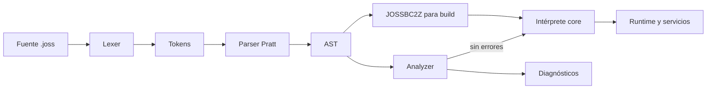

# Arquitetura da linguagem Joss

[Índice](README.md) · Antes: [status](ESTADO_IMPLEMENTACION.md) · Depois: [contribuir](CONTRIBUIR.md)

## Pipeline real

```text
fuentes .joss
  → lexer (`pkg/parser/lexer.go`)
  → parser Pratt (`pkg/parser`)
  → AST (`pkg/parser/ast*.go`)
  → análisis semántico (`pkg/analyzer`)
  → diagnósticos (`pkg/diagnostics`)
  → intérprete AST (`pkg/core/evaluator*.go`, `executor.go`)
  → runtime integrado (`pkg/core`, `pkg/server`)
```



`joss analyze` preserva cada arquivo como `analyzer.SourceUnit`; não concatena ASTs perdendo a origem. Primeiro registra declarações globais de funções e classes e depois analisa cada método com um escopo léxico independente. As aulas nativas vêm de `Runtime.RegisterNativeClasses`; Os plug-ins fornecem seus índices de símbolos JP v2.

## Responsabilidades

| Pacote | Responsabilidade |
|---|---|
| `pkg/parser` | Tokens, lexer, precedências, analisador e nós AST. |
| `pkg/typesystem` | Nomes canônicos, inferência, coerção explícita e compatibilidade de atribuição. |
| `pkg/analyzer` | Unidades de origem, escopos, símbolos, inferência de expressões, assinaturas e fluxo alcançável. Não depende do tempo de execução. |
| `pkg/diagnostics` | Modelo comum: código, gravidade, mensagem, arquivo, intervalo, explicação e dica. |
| `pkg/core` | Adaptação de catálogos reais ao analisador, interpretador e primitivas integradas. |
| `pkg/runtime/errors` | Erro de tempo de execução estruturado e Joss stack frames, sem dependências de framework. |
| `pkg/runtime/value` | Semântica de valor independente do avaliador, incluindo indexação Unicode. |
| `pkg/runtime/plan`, `pkg/runtime/frame` | Planos resgatáveis, slots e representação etiquetada usados ​​para acelerar a resolução local; eles não formam bytecode portátil. |
| `pkg/pluginruntime`, `pkg/pluginpkg` | Carregamento isolado, verificação e resolução de símbolos de plugins JP v2. |
| `pkg/bytecode` | Serialização compactada do AST. Não é código de máquina ou LLVM IR. |
| `pkg/vm` | VM/compilador experimental independente. A CLI e `pkg/core` não os utilizam como rota padrão. |
| `cmd/joss` | CLI, análise, execução, construção e administração de projetos. |
| `vscode-joss` | LSP/editora. Consome o catálogo gerado do kernel. |

## Fontes da verdade

- Palavras-chave e símbolos: `pkg/parser/token.go`; `parser.KeywordNames()` e `parser.SymbolDefinitions()` são as projeções para lexer, formatador e geradores.
- Tipos e compatibilidade: `pkg/typesystem`, incluindo classificações semânticas como `Type.IsNumeric()`.
- Métodos primitivos: nome e retorno em `pkg/typesystem/primitive_methods.go`. `pkg/analyzer` projeta esses metadados e `pkg/core/primitives.go` preserva apenas a implementação do tempo de execução. Qualquer definição deve ser coberta por `TestPrimitiveMethodCatalogHasRuntimeImplementations`.
- Integrados globais: `pkg/core/builtins.go` declara nome, domínio do despachante e retorna uma vez. O tempo de execução é despachado diretamente por esse descritor e rejeita nomes fora do catálogo.
- Classes/métodos nativos: chamadas para `registerNative` dentro de `Runtime.RegisterNativeClasses()`; Seus retornos são digitados em `pkg/core/native_signatures.go`.
- Símbolos de plug-in: `pluginpkg.SymbolIndex` incluídos em cada `.jp`.
- Diagnósticos: `pkg/diagnostics.Diagnostic` e códigos emitidos por `pkg/analyzer`.
- Catálogo VS Code: `vscode-joss/src/server/generated/languageCatalog.json`, gerado usando `go run ./tools/cataloggen`.

CI é executado `go run ./tools/cataloggen --check`; editar manualmente o catálogo gerado não é válido.

## Escopos e símbolos

- Cada função, método, `Init` e encerramento tem seu próprio escopo.
- Os parâmetros pertencem apenas ao seu callable.
- Os blocos de controle usam o escopo do chamável para refletir o tempo de execução atual.
- A ligação `foreach` pode ser reutilizada em outro loop; o tempo de execução trata isso como uma atribuição.
- Classes e funções de nível superior são resolvidas no nível do projeto.
- Globais nativos e símbolos de plug-in são injetados usando `analyzer.Environment`.
- Uma função nomeada não herda variáveis ​​de origem do chamador ou variáveis ​​de nível superior: ela recebe parâmetros, locais, `this` e ligações do host/plugin. Um fechamento captura lexicamente.
- Os parâmetros requerem tipo explícito; `mixed` nunca é apresentado silenciosamente.
- Um parâmetro `ref` recebe um alias temporário para a ligação mutável do chamador. O analisador e o tempo de execução requerem marcação bilateral, valor l, não constância e tipo exatamente invariante.
- A visibilidade não tem padrão: analisador, analisador e tempo de execução preservam e validam `public`, `private` e `protected`.

## Construa e execute

O modo de desenvolvimento interpreta o AST. Cada invocação de callable cria um quadro lexical independente; não há escopo dinâmico entre chamador e receptor. Isso evita que uma chamada recursiva leia ou substitua as localidades do chamador. O tempo de execução limita a profundidade a 1.024 quadros por padrão e os encerramentos gravam apenas no ambiente capturado. Os tipos de retorno anotados são validados no analisador/tempo de execução e o analisador requer uma conclusão exaustiva e comprovável.

Antes de executar uma chamada, `pkg/runtime/plan` pode atribuir slots a parâmetros
e locais. `frame_runtime.go` usa esses slots e mantém um substituto para ligações
que não se enquadram no plano. Os metadados de classe, acesso e escopo são armazenados em cache; qualquer
A mudança semântica deve comparar a rota rápida com a rota geral. Os controles
de loops buscam saltos diretos no AST planejado e hoje não cruzam todos
os ternários/match, limite registrado na auditoria.

Referências seguras não expõem ponteiros Go: `core.VariableReference` preserva a ligação valor/tipo/const durante uma chamada e é automaticamente desreferenciada pelo avaliador. Uma referência não é um valor Joss armazenável nem ultrapassa os limites assíncronos/plugin.

`pkg/bytecode` codifica o AST com `gob` e compactação sob o único cabeçalho aceito `JOSSBC2Z`. Native compila um pacote que codifica byte junto com o executor Go; Atualmente não há back-end LLVM/Cranelift ou tradução AOT do programa Joss para código de máquina. O compilador do plugin possui um JPBC IR separado; Não deve ser confundido com o pipeline do idioma host.

A árvore `pkg/vm` contém opcodes e uma VM experimental. Sua aritmética e sua
erros não definem a semântica publicada enquanto não estão conectados ao pipeline
antigo. Da mesma forma, o JPBC define apenas a execução do plugin. Ao documentar
“compilação” indica qual das três representações está sendo usada.

##Regra de dependência

Camadas de linguagem (`parser`, `typesystem`, `diagnostics`, `analyzer`) não importam `core`. `core` adapta seus logs ao analisador. Este endereço evita que o verificador de tipo dependa dos efeitos colaterais do servidor ou do banco de dados.

O servidor mantém seus adaptadores HTTP fora do interpretador: `request_data.go` traduz `net/http` para o mapa estável consumido por Joss e `rate_limiter.go` encapsula o estado de limitação. `handler.go` continua como orquestrador e não deve absorver essas responsabilidades novamente.

## Limites internos do avaliador

As chamadas mantêm uma única rota avaliada. `call_arguments.go` transforma expressões de origem e aplica ligação posicional/nomeada/default/ref; `call_method.go` instala parâmetros, gerencia o quadro, recursão, adia e retorna contrato; `callable_dispatch.go` adapta fechamentos, métodos vinculados, plug-ins e funções Go para esse caminho; `evaluator_call.go` resolve apenas uma chamada de origem e o domínio do integrado. Os pontos de entrada públicos históricos delegam, não reimplementam regras.

Os infixos são coordenados em `evaluator_infix.go` porque a ordem observável – coalescência, pipeline, curto-circuito, entrada, avaliação correta e saída – deve permanecer explícita. Seus comportamentos vivem por domínio em `evaluator_control.go`, `evaluator_pipeline.go`, `evaluator_numeric.go`, `evaluator_stream.go` e `evaluator_update.go`. Um operador não deve ser adicionado diretamente ao coordenador, a menos que isso afete a ordem de avaliação.

No analisador, `infer_nominal.go` estende `typesystem.Assignable` com classes/interfaces do projeto; `infer_narrowing.go` cria escopos refinados por `is` e comparações com null. Essas regras permanecem separadas do tempo de execução: elas compartilham tipos e metadados, não execução ou estado.

## Terceira fase da arquitetura — setembro de 2026

O analisador possui um pipeline semântico explícito: coleta de declarações, escopo do projeto, contratos nominais, órgãos/solicitáveis ​​e diagnósticos. As responsabilidades são separadas em arquivos no mesmo pacote para preservar o encapsulamento e evitar APIs públicas artificiais. `call_resolution.go` e `member_resolution.go` projetam funções, métodos, nativos, primitivos e plugins para a assinatura semântica de `Callable`; a execução continua em `core`.

Antes de mudar a infraestrutura, foram adicionadas caracterizações de tempo de execução (fork/reset/reuse), HTTP (503, CORS, sessões, CSRF e resposta) e publicação (ZIP, traversal, lockfile e registro). Esses testes já encontraram e corrigiram um caso real de estado residual em `Runtime.Free`. O manipulador e a CLI ainda são grandes coordenadores: a extração está condicionada à conclusão do WebSocket, mapeamento de resposta e mais casos de registro.

As regras negativas são mantidas: o analisador não importa o núcleo, o analisador não conhece o tempo de execução, o servidor não redefine a semântica, o formatador não descarta curiosidades para reutilizar o lexer e a VM não define a semântica publicada. `@json` e `NativeMethodDefinition` permanecem como dívidas P1 até que uma representação comum sustentável esteja disponível.

## Quarta fase da arquitetura — setembro de 2026

O ciclo de vida do tempo de execução reside em `runtime_lifecycle.go`: construção, pool, aquisição, vinculações de host e redefinição. `Runtime.Free` remove todos os estados e caches por solicitação/por execução; não fecha `DB`, porque o pool SQL é um recurso externo compartilhado cujo proprietário é o aplicativo. `Fork` copia mapas mutáveis, redefine cursores/caches e compartilha apenas configuração AST/planes/imutável, plugin de registro e recursos externos. Os testes simultâneos e de isolamento protegem essas regras.

`MainHandler` adquire o fork e registra imediatamente uma limpeza única. A adaptação dos resultados reside em `response_writer.go`; a decodificação da solicitação continua em `request_data.go`, a limitação de taxa em `rate_limiter.go` e a sessão/CSRF permanece no manipulador até que seus back-ends sejam concluídos. A borda publicada reconhece string, JSON, RAW, FILE, STREAM e REDIRECT; outros valores continuam no arquivo/404 substituto.

`NativeMethodDefinition` são metadados semânticos, não tempo de execução de reflexão. Publica apenas nome, retorno e parâmetros confiáveis, distinguindo aridade desconhecida. Stack, Queue e Math são a migração inicial; as outras classes usam o adaptador legado. Todos são finalmente projetados para `analyzer.Callable` e gerados catálogos.

`pkg/viewtemplate` possui a sintaxe mínima de diretiva compartilhada. O scanner reconhece intervalos, aspas e parênteses aninhados; runtime e linter compartilham a interpretação de `@json`. As políticas de renderização, acesso a arquivos e lint permanecem em seus domínios.

A autoridade é explicitamente dividida: verdade de sintaxe no analisador, verdade de tipo em sistema de tipos/analisador, verdade de tempo de execução em intérprete/núcleo e ferramentas como projeção. A VM participa apenas de um corpus diferencial declarado para recursos suportados; nunca define a semântica publicada.

## Quinta fase da arquitetura — setembro de 2026

A quinta fase consolida a propriedade, a simultaneidade segura, os contratos de sessão e o ciclo de vida de plugins e WebSockets:

- **Propriedade de Plugins e Drivers Nativos**: O registro global de plugins atua como um catálogo de bibliotecas e ASTs imutáveis; cada `Runtime` implementa `PluginAwareHost` e gerencia seus próprios mecanismos de execução AST (`pluginASTEngines`) e namespaces (`PluginNamespace`). Ao realizar um `Fork()`, as instâncias do motor são duplicadas vinculadas ao tempo de execução bifurcado, garantindo que plugins com funções idênticas em pacotes diferentes não colidam e que o estado lexical nunca cruze as solicitações. Drivers dinâmicos (`NativeDriverDefinition`) implementam `Unload()` seguro e atômico usando primitivos de sistema operacional (`FreeLibrary`/`dlclose`), evitando vazamentos de memória ou chamadas simultâneas em bibliotecas descarregadas.
- **Contratos de sessão e Flash em respostas**: a persistência de dados de sessão e flash para redirecionamentos HTTP é unificada no contrato de armazenamento (`saveSession`). Qualquer falha na persistência da sessão durante um redirecionamento cancela a emissão do cabeçalho `Location` e gera um erro HTTP 500 determinístico, evitando que o cliente siga um redirecionamento com estado inconsistente.
- **Isolamento e retornos de chamada WebSocket**: A conexão WebSocket executa retornos de chamada reais em Joss (`onConnect`, `onMessage`, etc.) em um tempo de execução bifurcado separado, injetando corretamente parâmetros de rota (`$params`). Múltiplas conexões simultâneas não compartilham frames nem colidem na recepção/emissão de frames.
- **Runtime Pool Defense**: para evitar que vários retornos de um tempo de execução para `sync.Pool` causem corridas simultâneas em mapas de classe ou escopos, `Runtime.Free()` usa um guarda `freed` sincronizado com `poolMu`.
- **Expansão de metadados nativos**: o catálogo canônico é expandido migrando 10 classes nativas para `NativeMethodDefinition` (`Stack`, `Queue`, `Math`, `JSON`, `Markdown`, `Str`, `UUID`, `Lang`, `Console`, `Zip`), permitindo que o analisador e o LSP verifiquem parâmetros e retornem tipos sem invocar código Go nativo.
- **Posicionamento com reconhecimento de runas em modelos de visualização**: O scanner de diretiva e linter (`pkg/viewtemplate`) calcula colunas exatas contando runas UTF-8, garantindo consistência absoluta no diagnóstico contra caracteres multibyte.
